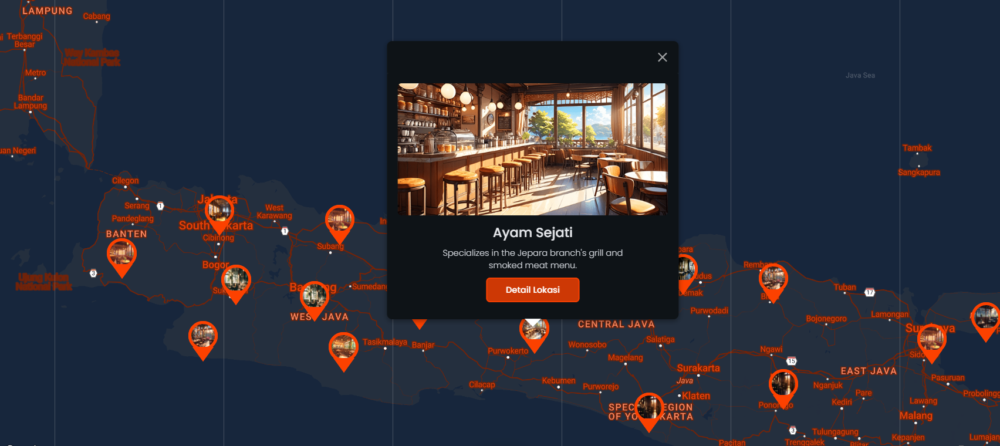
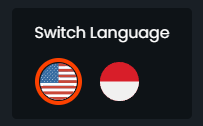
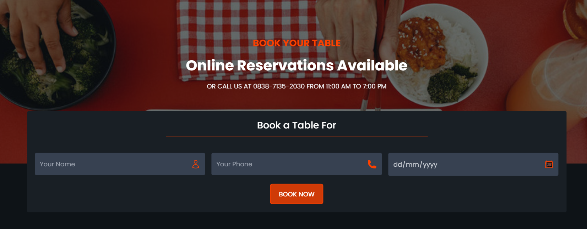
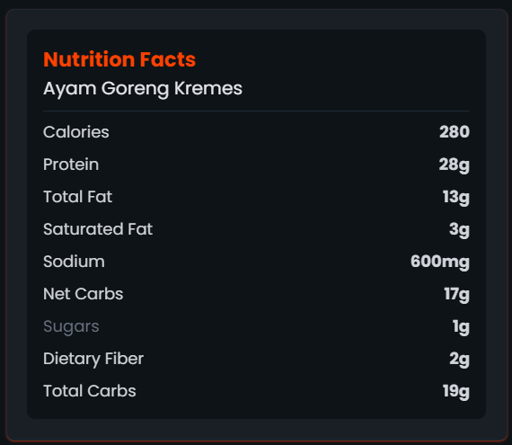
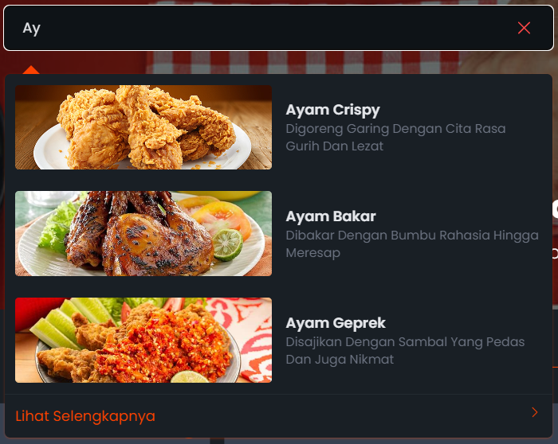

# GAYATAMA Cluck N Roll From ALOPE Team

Cluck n Roll adalah destinasi favorit bagi pecinta ayam dengan sentuhan yang unik! Di sini, kami menyajikan berbagai varian ayam lezat, mulai dari ayam penyet yang gurih dan pedas, hingga ayam bakar dengan aroma khas rempah yang menggugah selera. Setiap hidangan dipersiapkan dengan bahan-bahan segar dan bumbu pilihan, memberikan rasa autentik yang kaya dan tak terlupakan. Dengan suasana yang hangat dan santai, Cluck n Roll adalah tempat yang sempurna untuk menikmati hidangan ayam terbaik bersama keluarga dan teman. Nikmati kenikmatan ayam dengan gaya rock and roll!

DEMO LINK : [lihat](https://gayatama-cluck-n-roll.vercel.app/)

## Cara Instalasi

### Langkah 1

Clone project dengan menggunakan perintah

```bash
git clone https://github.com/Alope-Community/GAYATAMA_CluckNRoll.git
```

Alternatifnya, Anda dapat mengunduh proyek dengan mengeklik tombol "Code" di bagian atas dan memilih "Download ZIP".

### Langkah 2

Arahkan ke direktori projectnya (jika Anda mengunduh file ZIP, pastikan untuk mengekstraknya terlebih dahulu), lalu buka Command Prompt dan jalankan perintah berikut:

```bash
npm install
```

Tunggu proses instalasinya

### Langkah 3

Setelah berhasil menginstal dependensi, masukkan perintah untuk menjalankan server lokal.

```bash
npm run dev
```

### Langkah 4

Buka proyek di browser Anda dengan mengunjungi port yang disediakan setelah menyelesaikan langkah 3. (Port mungkin berbeda-beda, tetapi defaultnya adalah http://localhost:5173/)

### Langkah 5 (Optional Untuk Membuka Fitur Google Map)

1. Rename file .env.example menjadi .env
2. Replace keyword "YOUR_GMAP_API_KEY" menggunakan GOOGLE MAP API KEY yang anda punya
3. Untuk informasi lebih lanjut untuk mendapatkan Google Map API Key [disini](https://developers.google.com/maps/documentation/javascript/get-api-key)

Tidak memiliki kunci Google Maps API tetapi ingin melihat semua fiturnya? Coba lihat [disini](https://gayatama-cluck-n-roll.vercel.app/)

## Fitur Website

### Map Lokasi Restoran Ayam Cluck N Roll



Cabang ALOPE Taste House dapat dilihat di peta sehingga memudahkan pelanggan menemukan lokasi terdekat.

### Multi Bahasa (Indonesia & Inggris)



Cluck N Roll merupakan restoran ayam yang dapat dinikmati bukan hanya di skala nasional saja, melainkan internasional. Sehingga multi bahasa ini dapat mempermudah customer dari luar negara untuk tetap bisa menikmati Rajanya Masakan Ayam

|NOTE| Fitur ini masih dalam tahap onprogress, sehingga hanya bisa dinikmati di home page saja

### Booking



Fitur booking di Cluck N Roll memudahkan pelanggan melakukan reservasi meja secara online. Dengan sistem reservasi yang sederhana dan intuitif, pelanggan dapat memilih waktu dan jumlah tamu yang diinginkan, sehingga memastikan pengalaman bersantap yang lebih nyaman. Kami bertujuan untuk memberikan kenyamanan bagi pelanggan kami, baik yang berasal dari dalam negeri maupun internasional, sehingga mereka dapat menikmati hidangan kami tanpa harus menunggu.

### Fakta Nutrisi



Anda dapat melihat kandungan nutrisi pada setiap menu ayam kami. Sehingga anda dapat menakar dan memilih makanan sehat tanpa mengurangi nikmatnya ayam dari kami

### Search



Anda bisa mencari menu, lokasi dan kebutuhan nutrisi anda langsung dengan search
